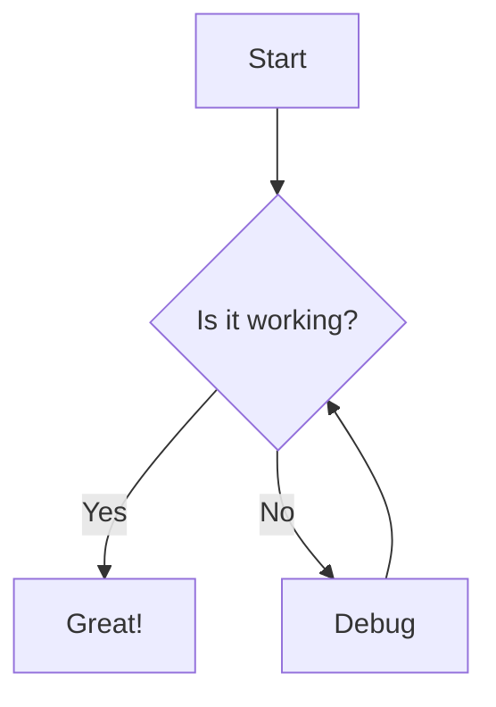

import { Callout } from "fumadocs-ui/components/callout";
import { Step, Steps } from "fumadocs-ui/components/steps";

Render interactive Mermaid diagrams in your chat messages by configuring a custom syntax highlighter for the `mermaid` language.

<Steps>
  <Step>

### Install dependencies

Install the required Mermaid package:

```bash npm2yarn
npm install @theguild/remark-mermaid
```

  </Step>
  <Step>

### Create Mermaid component

Create a Mermaid component and pass it to `componentsByLanguage`:

```tsx
import { Mermaid } from "@theguild/remark-mermaid/mermaid";
import { MarkdownText } from "@/components/assistant-ui/markdown-text";
import type { SyntaxHighlighterProps } from "@assistant-ui/react-markdown";

const MermaidDiagram: FC<SyntaxHighlighterProps> = ({ code }) => {
  return <Mermaid chart={code} />;
};

const MarkdownTextImpl = () => {
  return (
    <MarkdownTextPrimitive
      remarkPlugins={[remarkGfm]}
      className="aui-md"
      components={defaultComponents}
      componentsByLanguage={{
        mermaid: {
          SyntaxHighlighter: MermaidDiagram,
        },
      }}
    />
  );
};

export const MarkdownText = memo(MarkdownTextImpl);
```

  </Step>
  <Step>

### Use in messages

Users can now include Mermaid diagrams in their messages using the `mermaid` language tag:

````markdown

````

The diagram will render as an interactive SVG instead of syntax-highlighted code.

  </Step>
</Steps>

## Alternative Implementation

For more control over the rendering process, you can use the main `mermaid` package:

```bash npm2yarn
npm install mermaid
```

````tsx
import mermaid from "mermaid";
import { useContentPartText } from "@assistant-ui/react";
import { useEffect, useRef } from "react";

const MermaidDiagram: FC<SyntaxHighlighterProps> = ({ code }) => {
  const ref = useRef<HTMLPreElement>(null);

  // Check if the code block is complete (ends with triple backticks)
  const isComplete = useContentPartText(({ text }) =>
    text.split(code)[1]?.includes("```"),
  );

  useEffect(() => {
    if (!isComplete) return;

    (async () => {
      try {
        const element = document.createElement("div");
        element.innerHTML = code;
        element.classList.add("mermaid");
        ref.current!.replaceChildren(element);
        await mermaid.run({ nodes: [element] });
      } catch (e) {
        // Handle errors
      }
    })();
  }, [isComplete, code]);

  return <pre ref={ref}>Drawing diagram...</pre>;
};
````

<Callout>
  The `@theguild/remark-mermaid` approach is recommended as it handles
  initialization and error states automatically.
</Callout>

See the [Mermaid documentation](https://mermaid.js.org/) for complete syntax reference.
